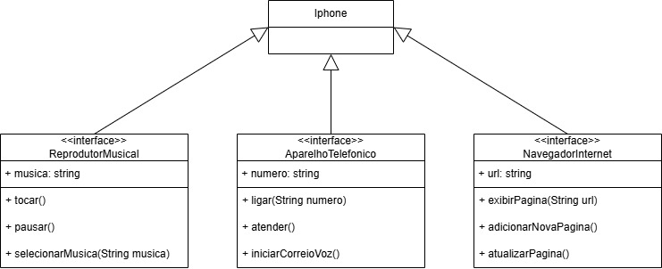

# Mini Projeto: Modelagem e Diagramação de um Componente iPhone

## Descrição

Este mini projeto tem como objetivo modelar e diagramar a representação UML do componente **iPhone**, abrangendo suas funcionalidades como **Reprodutor Musical**, **Aparelho Telefônico** e **Navegador na Internet**. A modelagem foi baseada nas funcionalidades apresentadas durante o lançamento do iPhone em 2007, seguindo o vídeo fornecido como contexto.

## Funcionalidades Modeladas

As funcionalidades principais do iPhone foram organizadas em interfaces, com métodos correspondentes a cada funcionalidade:

### 1. **Reprodutor Musical**

- **Métodos**:
    - `tocar()`: Inicia a reprodução de uma música.
    - `pausar()`: Pausa a música em reprodução.
    - `selecionarMusica(String musica)`: Seleciona uma música para reprodução.

### 2. **Aparelho Telefônico**

- **Métodos**:
    - `ligar(String numero)`: Liga para o número especificado.
    - `atender()`: Atende uma chamada recebida.
    - `iniciarCorreioVoz()`: Inicia o correio de voz.

### 3. **Navegador na Internet**

- **Métodos**:
    - `exibirPagina(String url)`: Exibe a página web no navegador com a URL fornecida.
    - `adicionarNovaAba()`: Adiciona uma nova aba ao navegador.
    - `atualizarPagina()`: Atualiza a página atual no navegador.

## Diagrama UML

O diagrama UML abaixo representa a relação entre as interfaces **ReprodutorMusical**, **AparelhoTelefonico**, **NavegadorInternet** e a classe **iPhone**, que implementa todas essas interfaces:



## Estrutura de Código

As interfaces e classes foram implementadas em Java. A classe `iPhone` implementa todas as funcionalidades descritas.

### Estrutura de Arquivos

```bash
bash
Copiar código
.
├── src
|   ├── aparelho
|   └──────── Aparelho.java
|   ├── aplicativos
│   ├──────── ReprodutorMusical.java
│   ├──────── AparelhoTelefonico.java
│   ├──────── NavegadorInternet.java
│   └──────── iPhone.java
└── README.md

```

### Exemplo de Código

### `ReprodutorMusical.java`

```java
java
Copiar código
public interface ReprodutorMusical {
    public void tocar();
    public void pausar();
    public void selecionarMusica(String musica);
}

```

### `AparelhoTelefonico.java`

```java
java
Copiar código
public interface AparelhoTelefonico {
    public void ligar(String numero);
    public void atender();
    public void iniciarCorreioVoz();
}

```

### `NavegadorInternet.java`

```java
java
Copiar código
public interface NavegadorInternet {
    public void exibirPagina(String url);
    public void adicionarNovaAba();
    public void atualizarPagina();
}

```

### `iPhone.java`

```java
java
Copiar código
package aplicativos;


public class Iphone implements NavegadorInternet, ReprodutorMusical, AparelhoTelefonico{
	String musica;
	String numero;
	String url;
	
	
	public void tocar() {
		System.out.println("TOCANDO MÚSICA DA KATY PERRY");
	}
	
	public void pausar() {
		System.out.println("PAUSANDO MÚSICA DA KATY PERRY");
	}
	
	public void selecionarMusica(String musica) {
		System.out.println("SELECIONANDO MÚSICA: " + musica);
	}
	
	public void ligar(String numero) {
		System.out.println("LIGANDO PARA O NÚMERO: " + numero);
	}
	
	public void atender() {
		System.out.println("ATENDENDO FULANO");
	}
	
	public void iniciarCorreioVoz() {
		System.out.println("INICIANDO CORREIO DE VOZ");
	}
	
	public void exibirPagina(String url) {
		System.out.println("EXIBINDO PÁGINA: " + url);
	}
	
	public void adicionarNovaPagina() {
		System.out.println("ADICIONANDO NOVA PÁGINA");
	}
	
	public void atualizarPagina() {
		System.out.println("ATUALIZANDO PÁGINA");
	}
}

```
